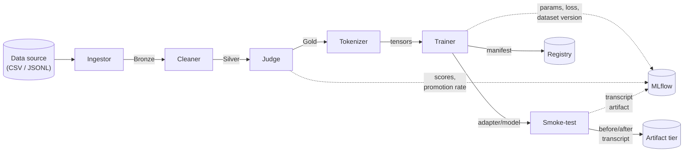
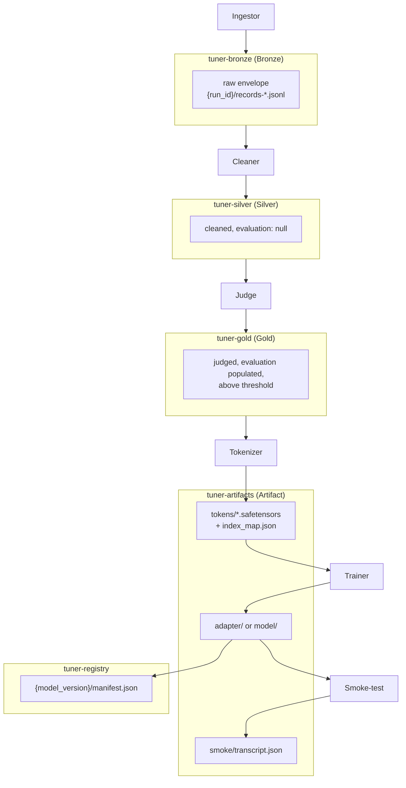

# Architecture overview

This page explains how Tuner fits together, and *why* it's shaped this way,
for someone who wants to understand the system before operating it. It's
deliberately less precise than the engineering specification it's drawn
from — [docs/spec/01-architecture.md](spec/01-architecture.md) — which is the
place to go when a name, a format, or an edge case needs to be exact. This
page just needs to be right about the shape.

## The one-sentence version

Tuner turns raw enterprise conversation data into a fine-tuned model, in six
stages that each read one tier of shared object storage and write the next,
with every model version traceable back to the exact dataset and experiment
that produced it.

Two things to notice already: the flow is a straight line with no branches
or loops (no stage ever calls back to an earlier one), and MLflow sits off to
the side as a shared logging destination rather than as another tier in the
chain — every stage that writes there does so in addition to its normal
object-storage output, never instead of it.

## Why a straight line of stages, each stateless

Every stage — Ingestor, Cleaner, Judge, Tokenizer, Trainer, Smoke-test — is
invoked as a CLI, reads its input **only** from one object-storage tier,
writes its output **only** to the next tier, and holds no state between
invocations. All coordination between stages happens through what's sitting
in object storage plus one shared identifier, the run ID — not through
in-memory hand-off, a message queue, or a database.

That shape is a direct consequence of one design goal: **the same stage code
should work as a local CLI against MinIO today and as a Kubeflow Pipelines
component against S3 tomorrow, without code changes.** A KFP component *is*
a stateless container that reads inputs and writes outputs through declared
artifacts — so a pipeline built that way from day one costs nothing extra
locally (it's just a CLI you can run by hand) and needs no rewrite to become
cloud-native later (only packaging changes: see
[docs/spec/05-infrastructure.md §4](spec/05-infrastructure.md)). It also
buys a much more immediate benefit: statelessness is what makes "re-run the
failed stage" a complete recovery procedure. A stage that crashes halfway
through deletes and rewrites only its own run's output prefix on its next
invocation — it never has to figure out what it already did, because it
never remembers.

Two orchestrators can drive these same CLIs without either one needing the
stages to know which is in charge:

- **Locally (MVP):** `tuner run --config <path>` is a deliberately dumb local
  driver — it generates one run ID, invokes each stage in order as a
  subprocess, and aborts on the first non-zero exit code. No retries, no
  partial resume; re-running a stage by hand with the same run ID *is* the
  resume mechanism, per the idempotency contract above.
- **In the cloud (Phase 3, not yet built):** each stage image becomes a KFP
  component, and the DAG mirrors the same order. Retries and caching become
  platform-native instead of hand-rolled.

## The medallion tiers, and why each stage sees only one

Object storage is organized into tiers of increasing data quality — the
[medallion architecture](https://www.databricks.com/glossary/medallion-architecture)
pattern — plus two tiers that hold pipeline outputs rather than
progressively-refined data:

| Tier | Bucket | Holds | Written by |
| :--- | :--- | :--- | :--- |
| Bronze | `tuner-bronze` | raw source records, byte-faithful, wrapped in a metadata envelope | Ingestor |
| Silver | `tuner-silver` | cleaned, scrubbed, deduplicated conversations (same schema as Gold, `evaluation: null`) | Cleaner |
| Gold | `tuner-gold` | Silver records that passed LLM judging, `evaluation` populated | Judge |
| Artifact | `tuner-artifacts` | tokenized tensors, trained adapter/model weights, smoke-test transcripts | Tokenizer, Trainer, Smoke-test |
| Registry | `tuner-registry` | one manifest per trained model version, linking weights ↔ dataset ↔ experiment | Trainer, Registry ops |

The rule enforced everywhere — in code, and mechanically at the storage
layer — is that a stage is granted **read** access only to the tier(s) it
consumes and **write** access only to the tier(s) it produces, never blanket
access. Most stages are exactly "one in, one out": the Cleaner reads Bronze
and writes Silver; the Judge reads Silver and writes Gold; the Tokenizer
reads Gold and writes Artifacts. A few have a wider footprint by design — the
Trainer both reads and writes the Artifact store and also writes the
Registry, and most stages additionally get a read grant on a reserved
`assets` bucket held for a future multimodal phase and unused today.
Concretely: the Ingestor cannot write to Gold, and the Trainer cannot read
Bronze, because neither principal holds *any* grant on that bucket at all
(the full IAM matrix is in
[docs/spec/05-infrastructure.md §5](spec/05-infrastructure.md)).

This isn't just tidiness. It's what makes the audit trail actually mean
something: since a stage's only way to influence what comes next is the tier
it's allowed to write, a bad actor or a bug in the Cleaner can corrupt
Silver, but it categorically cannot forge a Judge score or reach back and
rewrite Bronze — there's no credential that would let it. The blast radius
of any one stage is fixed by the bucket ACLs, not by code discipline. The
data itself carries the same guarantee in miniature: every tier manifest past
Bronze (which has no upstream tier — `input` is null there) records
`input.manifest_uri`, the exact upstream manifest it was built from, so from
a Gold record you can walk `Gold → Silver → Bronze` and land on the literal
source row it came from — full lineage, not just "trust the pipeline."

## Run IDs: the only thing that ties a pipeline execution together

There is no shared pipeline-execution record anywhere — no row in a
database that says "run X consists of these five stage invocations." The
run ID is the entire coordination mechanism: `tuner run` generates one
(format `run-{YYYYMMDD}-{HHMMSS}-{6 lowercase hex}`, UTC), passes it to every
stage as `--run-id`, and every stage writes its output under
`{run_id}/...` in its own bucket. That's also why "re-run a stage by hand" is
a real recovery path and not a special case: you supply the same run ID and
`--config`, and the stage looks in exactly the same places its predecessors
did.

The same identifier threads through the parts of the system that aren't
object storage, too: it appears as the MLflow tag `tuner.run_id` on every run
Tuner creates, and as the `run_id` field inside the registry manifest. A
trained model's own version string is derived from it —
`{adapter_name}-{run_id}` — so "which run produced this model" is never a
lookup, it's substring of the model version itself.

## Object storage + MLflow: two systems, two jobs

Object storage (MinIO locally, anything S3-compatible in the cloud) is where
the pipeline's *data* lives — every tier's records, the tokenized tensors,
the trained weights, the registry manifests. MLflow is where its
*experiment history* lives — hyperparameters, loss curves, judge score
distributions — plus the smoke-test transcript, attached as an artifact
rather than duplicated. Both are populated by the same run: the Judge opens
its own MLflow run (tagged `tuner.stage: judge`), and the Trainer opens
another (tagged `tuner.stage: trainer`) that the Smoke-test later attaches
its transcript to. Because several stages across a run can each have their
own MLflow run under the same `tuner.run_id` tag, the actual unique lookup
key for "this stage's run within this pipeline execution" is the *pair*
`(tuner.run_id, tuner.stage)`, not `tuner.run_id` alone — the Smoke-test
finding the Trainer's run to attach to is the concrete case this matters for.

All of this is entirely env-var-driven (`TUNER_S3_*`, `MLFLOW_TRACKING_URI`)
rather than baked into config files or code, which is what lets the exact
same stage binary talk to local MinIO in development and a cloud object
store/shared MLflow deployment in production — only the environment changes,
never the pipeline.

## The model-adapter abstraction: what makes the fine-tune target pluggable

Everything that's specific to *which* model is being fine-tuned — the
Hugging Face repo ID, the chat template quirks, LoRA target-module names,
default hyperparameters, whether full-parameter fine-tuning is even sane for
this model's size — lives behind one interface, `ModelAdapter`
(`src/tuner/models/base.py`), never inside a stage. The Tokenizer, Trainer,
and Smoke-test are model-agnostic; they ask the adapter selected by
`model.adapter` in the config for everything they need to know about the
model. If a stage were ever found branching on `adapter.name`, that would be
treated as a design bug, not a style nit — see
[docs/spec/04-model-adapters.md](spec/04-model-adapters.md).

The reason this is worth a first-class abstraction rather than a config flag
is stated directly in the product scope: the team's model access can change,
and the original spec (the SAS) deliberately doesn't fix a target model.
Making "which model" a pluggable adapter means swapping models is a config
change (`model.adapter: <name>`), and *supporting* a new model is a one-file
addition (a new adapter class registered by name) — not a change scattered
across five stage implementations. The shipped default is `gemma-e4b`
(Google Gemma E4B); the repository also ships a second adapter,
`tiny-test` (a 135M-parameter model), that exists purely so the pipeline's
own tests — and the CPU-fast path in
[00-getting-started.md](00-getting-started.md) — can exercise real
tokenizer/trainer code paths without needing a GPU or a multi-billion
parameter download.

## What this page didn't cover

This is the "how it fits together" view. For the exact schema of every
record and manifest, see [docs/spec/02-data-contracts.md](spec/02-data-contracts.md)
(normative — it wins over code if the two ever disagree). For what each
stage's CLI actually accepts, see [02-cli-reference.md](02-cli-reference.md).
For every config key, see [03-configuration.md](03-configuration.md).
