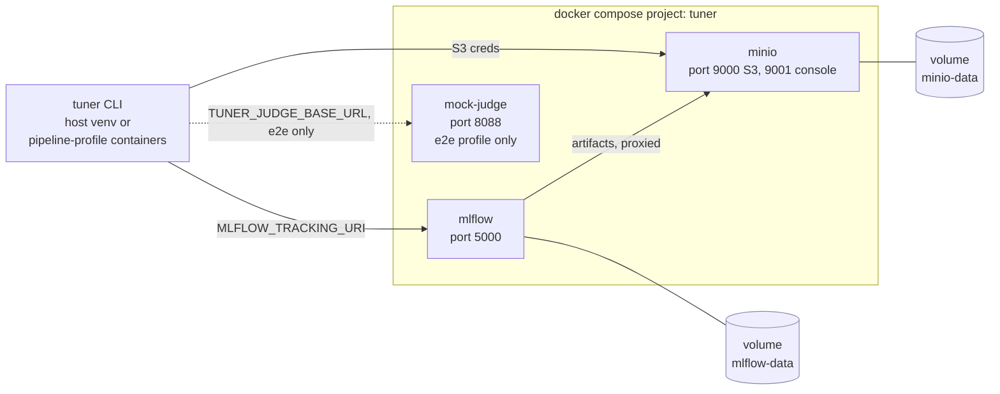

# Operations & troubleshooting

This page is for running Tuner day-to-day, past the first tutorial run in
[Getting started](00-getting-started.md): keeping the local stack healthy,
finding a given run's data after the fact, and working through what actually
goes wrong. It supersedes Getting started's own short "Troubleshooting"
section as the fuller reference — that section is still there and still
correct, this page just goes further.

Everything below was checked against this repository while writing this
page: real `docker compose` commands against the same compose file you have,
real pipeline runs, and a few things deliberately broken on purpose to see
what actually happens (a stage's credential used somewhere it isn't
granted, a port taken out from under MinIO, a stage re-run by hand against
data that already has a trainer run in MLflow) — not inferred from the spec
alone. Where something wasn't practical to verify directly, it says so.

## 1. The running stack

`docker compose up -d minio minio-init mlflow` (plus `mock-judge` under the
`e2e` profile — see [Getting started §4](00-getting-started.md)) is the whole
local footprint. Nothing else runs continuously: `ingestor`, `cleaner`,
`judge`, `tokenizer`, `trainer`, and `smoke` are all `profiles: ["pipeline"]`
in `docker-compose.yaml` — one-shot containers meant to be driven by `tuner
run` or `docker compose run`, not resident services you start and leave up.



The compose file pins `name: tuner` at the top specifically so that every
worktree of this repo — this guide's own included — addresses the *same*
stack instead of each starting a second, port-colliding one. That's
deliberate: it also means `docker compose down` from any worktree affects
every other worktree's view of the stack.

### Checking health

```
$ docker compose ps
NAME                 IMAGE                   SERVICE      STATUS
tuner-minio-1        minio/minio             minio        Up (healthy)
tuner-mlflow-1       ghcr.io/mlflow/mlflow   mlflow       Up (healthy)
tuner-mock-judge-1   tuner-mock-judge        mock-judge   Up (healthy)
```

(`minio-init` won't appear here once it's done — it's a one-shot job, not a
resident service; see Getting started §3 for why `Exited (0)` there is
success, not a crash.) The `(healthy)` suffix comes from each service's own
`healthcheck:` — `curl` against MinIO's `/minio/health/live` and MLflow's own
`/health` (which replies with a plain `OK`, verified directly). `docker
compose logs <service>` is the next step when a container won't turn
healthy; `docker compose logs minio-init` in particular is where a bootstrap
failure (§4 below) shows up, since that container exits either way and
`ps` alone won't tell you if it exited `0` or not.

The same three endpoints are reachable directly, which is a faster check
than parsing `ps` output when you just want a yes/no:

```
curl -f http://localhost:9000/minio/health/live   # MinIO
curl -f http://localhost:5000/health              # MLflow
curl -f http://localhost:8088/docs                # mock-judge (e2e profile only)
```

**A container reporting `(healthy)` is not proof its port is reachable from
the host.** The healthcheck runs *inside* the container's own network
namespace, so it passes regardless of whether Docker's host-port mapping
actually bound. We hit exactly this after a port conflict during testing for
this page (§4 below has the conflict itself): `docker compose up -d minio`
after MinIO had failed to bind port 9000 once brought the container back
`Up (healthy)` with an **empty** `PORTS` column in `docker compose ps` —
healthy container, unreachable from the host. `docker compose up -d
--force-recreate minio` fixed it immediately. If a service is "healthy" but
`curl` to its port fails, try that before anything more exotic.

### Stopping and restarting

- `docker compose stop` / `docker compose start` — pauses/resumes containers,
  keeps everything (containers, volumes, the network). Safe, no data lost,
  verified.
- `docker compose down` — removes containers and the network, **keeps** named
  volumes (so MinIO's and MLflow's data survive). Verified directly: we wrote
  an object, ran `docker compose down` then `docker compose up -d minio
  minio-init mlflow`, and read the same object back afterward.
- **`docker compose down` does not touch `mock-judge`, or the network, by
  default.** `mock-judge` carries `profiles: ["e2e"]`, and a plain `down`
  only manages default-profile services — verified directly: with
  `mock-judge` running, `docker compose down` (and even `docker compose down
  -v`) left it up and printed `Network tuner_default Resource is still in
  use`. If you brought the stack up with `--profile e2e`, tear it down the
  same way: `docker compose --profile e2e down`.
- `docker compose up -d <service>` on an already-running healthy service is a
  no-op; on one that's unhealthy or in the port-mapping state above, add
  `--force-recreate`.

### What state lives where

| State | Lives in | Survives `down` | Survives `down -v` |
| :--- | :--- | :-: | :-: |
| All 7 buckets' objects (bronze/silver/gold/artifacts/registry/assets/mlflow) | Docker volume `tuner_minio-data` | yes | **no** |
| Per-stage MinIO users + policies (§5, `bootstrap_minio.py`'s work) | inside the same MinIO state, `tuner_minio-data` | yes | no — recreated fresh by `minio-init` next `up` |
| MLflow experiments/runs/params/metrics/tags | Docker volume `tuner_mlflow-data`, `sqlite:////mlflow-data/mlflow.db` (`docker-compose.yaml`'s `--backend-store-uri`) | yes | **no** |
| MLflow run artifacts (transcripts, score histograms) | proxied by the MLflow server into the `tuner-mlflow` bucket — i.e. also `tuner_minio-data` | yes | **no** |
| Built container images (`tuner-minio-init`, `tuner-mock-judge`, …) | local Docker image cache, not a named volume | yes | yes |

Verified end to end while writing this page: `docker compose down -v` really
does delete both named volumes (`docker volume ls` showed neither
afterward), and every bucket came back empty on the next `up` — see §5 for
the full sequence.

### Clean reset

```bash
docker compose --profile e2e down -v   # add --profile e2e only if you ever ran with it
docker compose --profile e2e up -d minio minio-init mlflow mock-judge
```

We ran exactly this against this repository's own stack: both volumes gone,
stack back up, all four health checks returning `200`/`OK` again, all seven
buckets present and empty, and the same eight MinIO principals (`ingestor`
through `mlflow`) recreated with matching policies — `minio-init`'s bucket
and IAM setup is idempotent from nothing, not just re-runnable against an
existing store. See §5 for what this means for anything you actually wanted
to keep.

## 2. IAM in practice

The bucket-per-tier, principal-per-stage model is specified in full in
[docs/spec/05-infrastructure.md §5](spec/05-infrastructure.md) (the matrix
itself) — this section is only about what it feels like to run into it.

**What you'll actually see.** An operation outside a principal's grants comes
back as a plain S3 `AccessDenied`, HTTP 403 — there's no Tuner-specific
wrapping of it. Reproduced directly against this stack: the Cleaner's own
scoped credential (`R` on `tuner-bronze`, `W` on `tuner-silver` per the
matrix — no write grant on Bronze) attempting `PutObject` on `tuner-bronze`:

```
An error occurred (AccessDenied) when calling the PutObject operation: Access Denied.
```

And when that happens inside an actual stage invocation rather than a raw
S3 call, it surfaces through the CLI's generic "unexpected failure" path —
exit code `1`, not `2` (it isn't a config-validation failure, it's a runtime
one). Verified by running `tuner ingest` with the Cleaner's credential pair
in place of the Ingestor's (the Cleaner has no write grant on
`tuner-bronze`, which is exactly what Ingestor needs):

```
$ TUNER_S3_ACCESS_KEY=<cleaner's key> TUNER_S3_SECRET_KEY=<cleaner's key> uv run tuner ingest --run-id <id> --config configs/pipeline.e2e.yaml
ingest: An error occurred (AccessDenied) when calling the PutObject operation: Access Denied.
$ echo $?
1
```

**Why this happens, in practice, almost always traces back to one of two
things:**

1. **A `.env` mix-up when running stages from a host venv.** The per-stage
   variable names in `.env.example` (`INGESTOR_S3_ACCESS_KEY`,
   `CLEANER_S3_ACCESS_KEY`, …) only get wired into the matching *container's*
   `TUNER_S3_ACCESS_KEY`/`TUNER_S3_SECRET_KEY` by `docker-compose.yaml`. When
   you run a stage from a host venv instead (the GPU host-venv fallback, or
   just running everything from one shell the way
   [Getting started §4](00-getting-started.md) does), *you* set
   `TUNER_S3_ACCESS_KEY`/`SECRET_KEY` directly — and pointing them at the
   wrong stage's pair (or, as above, a single stage's pair when you actually
   need to touch multiple tiers) reproduces exactly the error above.
2. **Trying to run more of the pipeline than one credential covers.**
   `.env.example`'s own comment is explicit that a single host process
   driving the whole pipeline should use the `MINIO_ROOT_USER`/`PASSWORD`
   pair for `TUNER_S3_*`, because no individual stage's scoped principal has
   grants across every tier the pipeline touches end to end.

**This is a real boundary, not a bug to route around.** If you're tempted to
"fix" an `AccessDenied` by widening a policy or swapping in the root
credential permanently, stop — the whole point of the matrix (per
[docs/spec/05-infrastructure.md §5](spec/05-infrastructure.md)) is that the
Ingestor *cannot* write Gold and the Trainer *cannot* read Bronze, so that no
single stage's compromise or bug can reach data it has no business touching.
An `AccessDenied` from a stage's own scoped credential trying something
outside its row in the matrix means the policy is doing its job.

## 3. Inspecting a run

Everything for a given `run_id` sits under a `{run_id}/` prefix in each
tier's bucket (`{model_version}/` — i.e. `{adapter}-{run_id}/` — in
`tuner-registry`). There's no cross-tier index beyond that shared prefix and
the manifest chain described below.

**Browsing it.** The MinIO console (<http://localhost:9001>, log in with
`MINIO_ROOT_USER`/`PASSWORD`) lets you navigate into a bucket and filter by
that prefix, and download any object — including a `manifest.json` — with a
click. This repo has no `mc`/MinIO-client CLI of its own (noted the same way
in [components/tokenizer.md](components/tokenizer.md)); for anything
scripted, the sanctioned path is `tuner.core.storage.StorageClient` (per
[CLAUDE.md](../CLAUDE.md)'s hard rule 1) — e.g.
`StorageClient().download_dir("tuner-artifacts", f"{run_id}/", local_dir)`
pulls a whole run's artifacts to disk in one call. `tuner registry list`
(below) is the one built-in CLI view across an entire tier.

**Reading a manifest.** Every tier producer writes `{run_id}/manifest.json`
last, as the commit marker — the schema is normative in
[docs/spec/02-data-contracts.md §3](spec/02-data-contracts.md), and each
component guide documents its own stage's `drops[].reason` values and
record shape, so this page won't restate those. What's worth knowing
operationally is the shape they all share — real Gold manifest from a run
against this repository:

```json
{
  "tier": "gold",
  "run_id": "run-20260904-050051-20ee85",
  "producer": {"stage": "judge", "version": "0.1.0"},
  "input": {"tier": "silver", "manifest_uri": "s3://tuner-silver/run-20260904-050051-20ee85/manifest.json"},
  "files": ["records-00000.jsonl"],
  "counts": {"read": 99, "written": 94, "dropped": 5},
  "drops": [{"reason": "below_threshold", "count": 5}]
}
```

`input.manifest_uri` is what lets you walk backward tier by tier —
Gold → Silver → Bronze — to the literal source row a given record came from,
per the lineage guarantee in
[Architecture overview](01-architecture-overview.md#the-medallion-tiers-and-why-each-stage-sees-only-one).
A missing manifest (wrong run ID, or an upstream stage that never completed)
is exactly what "upstream incomplete" means to a downstream stage — see the
failure-mode table below for the exact message.

**Finding it in MLflow.** Search by the `tuner.run_id` tag; the Judge and
Trainer both open their own MLflow run tagged with it, distinguished from
each other by the *pair* `(tuner.run_id, tuner.stage)` — `tuner.stage:
judge` or `tuner.stage: trainer` — per
[Architecture overview](01-architecture-overview.md#object-storage--mlflow-two-systems-two-jobs).
The Trainer's run additionally carries `tuner.adapter` and
`tuner.model_version` tags (verified against a real run) alongside the
hyperparameters, loss curve, and the smoke-test transcript attached as an
artifact under `smoke/`. `tuner run`'s own final output line
(`run: mlflow run: http://localhost:5000/#/experiments/...`) is a direct
link to the Trainer's run if you have it; otherwise the MLflow UI's search
box accepts `tags.\`tuner.run_id\` = '<run_id>'` directly.

**The registry.** `uv run tuner registry list` lists every trained model
version, newest first — real output against this repository:

```
MODEL_VERSION                                 ADAPTER         CREATED_AT             STATUS     FINAL_EVAL_LOSS
tiny-test-run-20260904-050051-20ee85          tiny-test       2026-09-04T05:01:25Z   candidate  1.8372868299484253
```

An empty registry prints `no models registered`, verified directly — not an
error, just nothing there yet. The registry manifest itself
(`{model_version}/manifest.json`) is the SAS-mandated link between weights,
dataset, and experiment: it carries `gold_manifest_uri` (which Gold tier
trained it), `index_map_uri` and `weights_uri` (which artifacts), and
`mlflow_run_id` (which experiment) all in one object — see
[components/registry.md](components/registry.md) for the full field list and
[components/trainer.md](components/trainer.md) for how it's produced.

## 4. Common failure modes

Every row below is either something we reproduced against this repository's
own stack while writing this page, or a message read directly from the
source it comes from — not a guess at what "probably" happens. Where we
couldn't practically reproduce something (real GPU-passthrough failure, in
particular — this sandbox's GPU passthrough works), that's called out in the
row itself rather than presented as fact.

| Symptom | Likely cause | What to do |
| :--- | :--- | :--- |
| `docker compose ps` shows a service without `(healthy)`, or it never turns healthy | The dependent service failed first — `mlflow` won't even start until `minio-init` exits `0` (`depends_on: condition: service_completed_successfully`) | `docker compose logs minio-init` first (it exits either way, so `ps` alone doesn't tell you if it failed); then `docker compose logs <service>` for whichever is stuck |
| `docker compose up` fails with `Bind for 0.0.0.0:<port> failed: port is already allocated` | Something else on the host already owns 9000/9001/5000/8088 | Reproduced directly (another container held 9000): find and stop whatever's on that port (`docker ps`, or `lsof -i :<port>` outside Docker), or remap the port in a local compose override |
| A service is `Up (healthy)` but `curl`/the browser can't reach its port; `docker compose ps`'s `PORTS` column is empty for it | The healthcheck runs inside the container and doesn't prove the host port bound — we saw this concretely after a port-conflict retry left the container "healthy" with no port mapping | `docker compose up -d --force-recreate <service>` — fixed it immediately in our test |
| `docker compose down` (or `down -v`) leaves `mock-judge` running and prints `Network tuner_default Resource is still in use` | `mock-judge` is `profiles: ["e2e"]`; a plain `down` only manages default-profile services — verified directly | `docker compose --profile e2e down` (add `-v` too for a full reset) |
| `...: missing required env var(s): TUNER_S3_ACCESS_KEY, ...` | `.env` missing/not filled in, or not exported into the shell running a host-venv stage | `cp .env.example .env`, fill it in, export it or inline it per [Getting started §4](00-getting-started.md) |
| `<stage>: An error occurred (AccessDenied) when calling ... Access Denied.` (exit `1`) | The credential in `TUNER_S3_ACCESS_KEY`/`SECRET_KEY` doesn't hold the grant that operation needs — reproduced directly with a mismatched stage credential | See §2 above: use the right per-stage pair inside its own container, or the MinIO root pair for a whole-pipeline host run — never widen the policy |
| `clean: missing manifest: s3://tuner-bronze/<run_id>/manifest.json` (or the same for any stage, exit `2`) | Wrong/typo'd `--run-id`, or the upstream stage never completed for that run ID — verified message, produced by pointing Clean at a run ID that was never ingested | Confirm the run ID, or re-run the missing upstream stage first — this is the "upstream incomplete" contract, not corruption |
| `train`/`smoke` fail immediately with `Error: 'train' needs the \`train\` extra ...` | Torch/transformers/peft/accelerate aren't installed — deliberately lazy-imported so other stages don't need them | `uv sync --extra train` |
| `train`/`smoke` hang, crash, or can't find a CUDA device under `method: qlora` | No GPU, or Docker GPU passthrough isn't set up for the `trainer`/`smoke` services' `deploy.resources.reservations.devices: [nvidia]` stanza. **Not reproduced in this sandbox** — its own GPU passthrough works, so we could confirm the *fix* end to end but not the original failure mode | Either fix passthrough, or use the sanctioned fallback: run just `train`/`smoke` from a host `uv` venv with `--extra train`, same env vars, no code changes ([docs/spec/05-infrastructure.md §3](spec/05-infrastructure.md)). `method: full` (no QLoRA) needs no GPU at all, as the CPU-fast path already uses |
| Judge hangs for minutes, then aborts with `judge: judge_error rate <n>/<n> exceeds 10% -- endpoint looks unhealthy, aborting` (exit `1`) | `TUNER_JUDGE_BASE_URL` is unreachable or wrong. Each record retries with exponential backoff before counting as a `judge_error`, so a fully dead endpoint fails *slowly*, not instantly — reproduced directly: 99/99 records errored against a closed port, taking a few minutes wall time, before the 10% abort threshold fired | Check `TUNER_JUDGE_BASE_URL`/`TUNER_JUDGE_API_KEY` are actually reachable from where the Judge runs (`http://host.docker.internal:...` from inside a container is not the same host as `http://localhost:...` from a host venv); see [components/judge.md](components/judge.md) for the full retry/threshold policy |
| `smoke: expected exactly one trainer run for run_id <id>, found 2` (exit `2`) | Object storage is idempotently overwritten on a re-run, but **MLflow runs are not** — re-running `tuner train` by hand for a `run_id` that already trained successfully once creates a *second* MLflow run tagged with the same `(tuner.run_id, tuner.stage: trainer)` pair, and Smoke's lookup requires exactly one match. Reproduced directly: ran `train` twice for one run ID, then `smoke` failed with `found 2` | Delete the stale/duplicate trainer run in the MLflow UI (or `POST /api/2.0/mlflow/runs/delete`), keeping the one that actually matches the artifacts you want Smoke to test against — verified directly: deleting the older of the two let `smoke` succeed immediately after |
| MinIO's disk usage keeps growing across many runs | Every run's data is additive — nothing is ever garbage-collected automatically. Measured directly against this repository's own dev stack: about **270 MB per completed `tiny-test`/`method: full` run**, almost entirely `tuner-artifacts` (full model weights); nine such runs had put the MinIO volume at 2.3 GB | There's no built-in cleanup command; delete a run's prefixes yourself with `StorageClient.delete_prefix(bucket, f"{run_id}/")` per bucket (root/admin credentials — a single stage's scoped principal can't reach every tier) once you've confirmed you no longer need that run, or reset entirely per §1 |
| A run failed partway and you want its storage gone before re-running it | Nothing does this automatically — a stage only deletes its *own* output prefix, and only when it next actually runs for that ID (the idempotency contract) | Either just re-run the same stage with the same `--run-id` (it deletes-then-rewrites its own tier on its own — no manual cleanup needed for that), or manually clear every tier's `{run_id}/` prefix (and `tuner-registry/{adapter}-{run_id}/` if training got that far) the same way as the disk-usage row above if you want it gone rather than retried |

## 5. Disaster recovery / rebuilding from scratch

Be honest about scope here: this is a **single-host Docker Compose MVP**.
There is no HA, no automated backup, and no cross-host replication story —
[docs/spec/05-infrastructure.md](spec/05-infrastructure.md) scopes exactly
that (§1–§3, §5, §6; §4's cloud/K8s topology is explicitly Phase 3, not
built). Nothing on this page should be read as implying more durability than
that.

**What's disposable, locally.** The entire compose stack — containers,
network, both named volumes — is throwaway and reproducible from
`docker-compose.yaml` plus `.env` alone. We verified the full cycle directly
against this repository: `docker compose --profile e2e down -v` (both
volumes confirmed gone via `docker volume ls`), then
`docker compose --profile e2e up -d minio minio-init mlflow mock-judge`
brought back all four health checks green, all seven buckets present and
empty, and all eight MinIO principals (`ingestor` through `mlflow`)
recreated with matching policies from `IAM_MATRIX` in
`scripts/bootstrap_minio.py` — bootstrapping is idempotent from a truly
empty store, not just safe to re-run against an existing one.

**What that actually costs you.** Everything in the table in §1 marked "no"
under `down -v` is gone for good once you do it: every tier's records, every
trained model's weights, every registry manifest, and all MLflow experiment
history. There is no snapshot/restore tooling in this repo today — a wiped
MinIO volume is not recoverable short of re-running the pipeline. If you've
trained something worth keeping, that means the object store (and ideally
the MLflow database) needs to live somewhere you'd actually back up before
you reach for `-v`.

**What would need to survive in a real deployment.** The object store is the
one thing the whole system's audit trail and reproducibility guarantee rests
on — the `input.manifest_uri` chain (§3 above) and the registry's
weights↔dataset↔experiment link only mean anything if the data they point at
still exists. In the cloud topology
([docs/spec/05-infrastructure.md §4](spec/05-infrastructure.md)), MinIO is
replaced by a real cloud object store and MLflow moves to a shared tracked
deployment with a real database backend instead of the local sqlite file —
at that point object-store durability and MLflow-backend durability become
that platform's job, not this repo's. As shipped today, for local
development, there's no such backing: the sqlite-on-a-volume MLflow backend
and the MinIO volume are both single points of failure by design, acceptable
for a dev/test MVP and explicitly not claimed to be anything more.

## Next steps

This is the last page in the user guide. If something here didn't answer
your question:

- [Architecture overview](01-architecture-overview.md) — why the system is
  shaped the way it is.
- [CLI reference](02-cli-reference.md) / [Configuration reference](03-configuration.md)
  — every flag and config key.
- The [component guides](README.md#user-guide) — per-stage behavior, manifest
  fields, and `drops[].reason` values this page deliberately didn't restate.
- [docs/spec/](spec/00-product-scope.md) — the normative engineering spec,
  if you need to cite an exact rule rather than this page's explanation of it.
